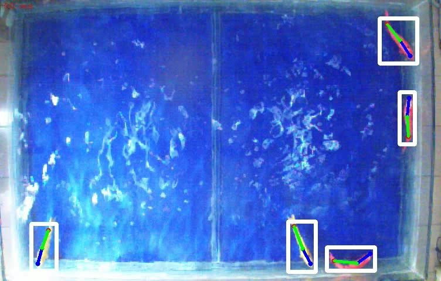
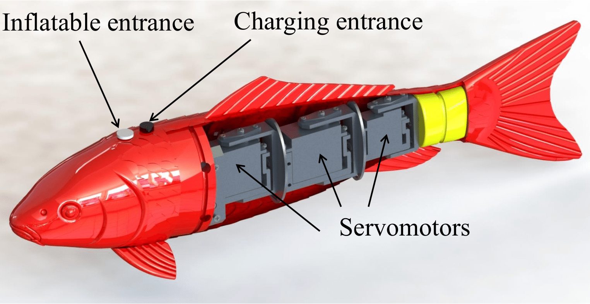
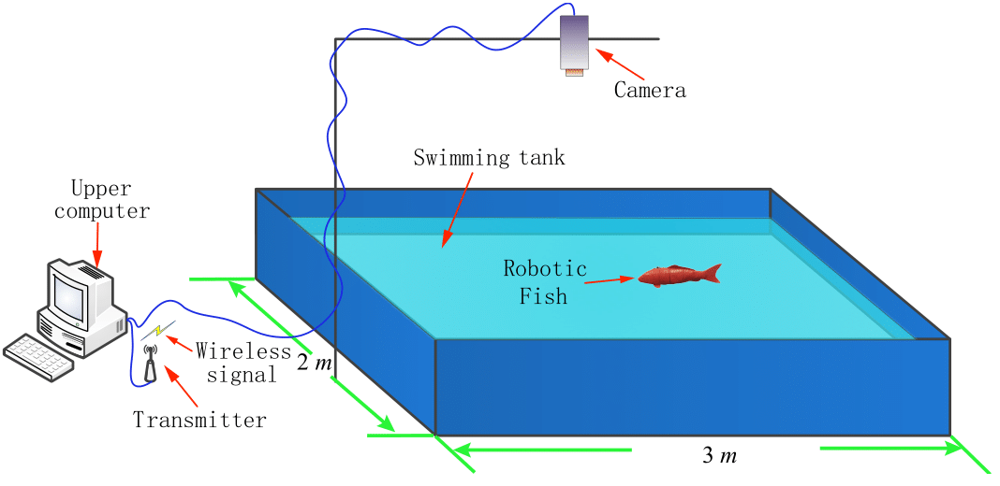

# Robotic-Fish-Pose-Dataset
Robotic-Fish-Pose-Dataset is a dataset for robotic fish pose estimation from **[Intelligent Biomimetic Design Laboratory (IBDLab)](http://en.ibdl.pku.edu.cn/)** of Peking University.  There are 818 frames of random labeled images, 500 frames of a labeled video and 9953 frames of unlabeled videos.

If you find our work useful in your research please consider citing our paper:
'''
@ARTICLE{9530612,
  author={Zhang, Tianhao and Xiao, Jiuhong and Li, Liang and Wang, Chen and Xie, Guangming},
  journal={IEEE/CAA Journal of Automatica Sinica}, 
  title={Toward Coordination Control of Multiple Fish-Like Robots: Real-Time Vision-Based Pose Estimation and Tracking via Deep Neural Networks}, 
  year={2021},
  volume={8},
  number={12},
  pages={1964-1976},
  doi={10.1109/JAS.2021.1004228}}
'''

# Download the Dataset

You can get this dataset from **[google drive](https://drive.google.com/file/d/19VOjZYqX83yEV79cPoG_1tD5Pztwv0Eg/view?usp=sharing)**. After downloading the zip file, extract it to a `Dataset` folder and enjoy yourselves!

# Sample images

The dataset contains different scenes of multiple robotic fishes, including some difficult scene like dense collision with the boundary and other fishes, Intense light reflection and twisted fish body. The resolution of each image is **752x480**. 

 

 

# Dataset Structure

The structure of dataset is shown as follows. **The label file is [COCO](https://cocodataset.org/#format-data) format json file**. Please use [COCOAPI](https://github.com/cocodataset/cocoapi)  to read the labels. The labeled video has been divided into images for compatibility with COCO format. The dataset is divided into two parts: 200 frames of one video for test and the others for training.

The labels includes the keypoints of **heads, bodys, tails** and the bounding boxes of individual fishes are generated from keypoint data.  **Note that the attributes of `segmentation` and `is_crowded` are unavaliable.**



```
Dataset
├── training
│   ├── trainImages.json
│   ├── trainImages
│   │   ├── 00008.jpg
│   │   ├── 00009.jpg
│   │   ├── ...
│   │   ├── ...
│   ├── trainVideos.json
│   ├── trainVideos
│   │   ├── 02000.jpg
│   │   ├── 02001.jpg
│   │   ├── ...
│   │   ├── ...
│   ├── unlabeledVideos
│   │   ├── 1.avi
│   │   ├── 2.avi
├── testing
│   ├── testVideos.json
│   ├── testVideos
│   │   ├── 02301.jpg
│   │   ├── 02302.jpg
│   │   ├── ...
│   │   ├── ...
```

# Experimental Platform
The robotic fishes are designed to mimic the morphology and kinematics of carp. It consists of a rigid head, a flexible body and a caudal fin with a total length of 0.443m. Data is collected from a platform which consists of a 3x2 m pool and a vertically global view camera 3 m above.

 


